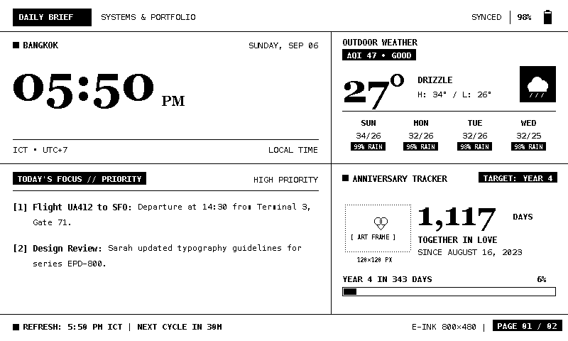
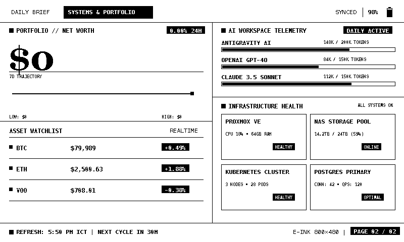

# ⚡ XIAO ESP32-S3 7.5" E-Paper Ambient Dashboard Template

[](https://github.com/SeanNachapat/xiao-epaper-dashboard-template/generate)
[](https://platformio.org/)
[](https://www.seeedstudio.com/XIAO-ESP32S3-p-5627.html)
[](https://www.seeedstudio.com/)
[](LICENSE)

A production-ready, serverless, ultra-low-power dashboard firmware and cloud rendering template designed for the **Seeed Studio TRMNL 7.5" DIY Kit** and 800×480 monochrome e-Paper displays (UC8179 / GDEY075T7 / EE04 driver board).

Combines **zero-cost serverless Python rendering** via GitHub Actions with **edge hardware intelligence** (on-device Georgia Bold typography, physical battery ADC sampling, and auto-cycling multi-page navigation).

---

## 📸 Live Visual Showcase

### Page 1: Daily Brief & Ambient Weather
Features real-time Georgia Bold serif hero clock, outdoor weather with 4-day forecast & AQI pill, priority daily focus items, and an anniversary/milestone tracker with visual progress bar.



### Page 2: Systems, Watchlist & Portfolio
Features net worth tracker with dynamic sparkline, live cryptocurrency & stock watchlist (Binance & Yahoo Finance), AI workspace telemetry, and homelab infrastructure health tiles.



---

## 🌟 Key Architecture & Highlights

```
┌─────────────────────────┐       ┌────────────────────────┐       ┌────────────────────────┐
│  Google Calendar & Mail │       │ Yahoo Finance / Binance│       │  Open-Meteo Weather    │
└────────────┬────────────┘       └───────────┬────────────┘       └───────────┬────────────┘
             │ (n8n / Webhooks)               │                                │
             ▼                                ▼                                ▼
    ┌─────────────────────────────────────────────────────────────────────────────────┐
    │ GitHub Actions Cloud Runner (generate_cloud_display.py)                          │
    │ Produces raw 48,000-byte 1-bit binary frames (page1.bin & page2.bin)            │
    └────────────────────────────────────────┬────────────────────────────────────────┘
                                             │ (Direct 48KB Stream over Wi-Fi)
                                             ▼
                             ┌───────────────────────────────┐
                             │ XIAO ESP32-S3 + EE04 E-Paper  │
                             │  + On-Device Georgia Clock    │
                             │  + Hardware ADC Battery Gauges│
                             │  + Deep Sleep & Auto-Cycle    │
                             └───────────────────────────────┘
```

* **⚡ 100% Serverless & Zero Subscription Costs**: No VPS, Docker containers, or paid cloud services needed. GitHub Actions schedules Python rendering every 30 minutes, producing 48,000-byte raw GxEPD2 binary streams hosted on GitHub Raw CDN.
* **🕒 Zero-Staleness On-Device Georgia Clock**: Storing full fonts in MCU flash is heavy, but cloud clocks lag behind when scheduled workflows delay. This project embeds a **2.4 KB Georgia Bold 68pt glyph header** (`georgia_clock.h`) that stamps the live NTP minute onto the downloaded frame right before writing to e-Paper. Your clock is always accurate to the exact minute.
* **🔋 Hardware Battery ADC & Power Isolation**: Uses a dedicated P-channel MOSFET voltage divider (`GPIO 1` & `GPIO 6`) to sample battery voltage and percentage without continuous power drain, and display power gating (`GPIO 43`) to kill boost converter quiescent draw during deep sleep.
* **🌤️ Free, Keyless Live Weather & Air Quality**: Integrates Open-Meteo API for real-time temperature, condition glyphs, high/low daily range, precipitation %, and US AQI status.
* **📈 Real-Time Equities & Crypto Watchlist**: Scrapes live prices for crypto (`BTC`, `ETH`, `SOL`) from Binance API and equities (`VOO`, `NVDA`, `AAPL`) from Yahoo Finance API without requiring any paid API keys.
* **🤖 Automation-Ready for n8n & AI**: All display data originates from [`custom_data.json`](custom_data.json). Update this file via n8n, Home Assistant, or GitHub REST API to instantly refresh your board.
* **🎛️ Physical Navigation**:
  * **KEY 1**: Instant Page 1 (Daily Brief & Weather).
  * **KEY 2**: Instant Page 2 (Systems, Watchlist & Portfolio).
  * **KEY 3**: Instant Toggle between Page 1 and Page 2.
  * **Auto-Cycle**: Automatically rotates pages every 30 minutes.

---

## 🛠️ Hardware Requirements (BOM)

| Component | Recommendation | Notes |
| :--- | :--- | :--- |
| **Microcontroller** | [Seeed Studio XIAO ESP32-S3](https://www.seeedstudio.com/XIAO-ESP32S3-p-5627.html) | Dual-core 240MHz, Wi-Fi 4, BLE 5.0, 8MB Flash / PSRAM |
| **E-Paper Panel** | 7.5" 800×480 Monochrome E-Paper | UC8179 / GDEY075T7 panel (Black / White) |
| **Driver Board** | Seeed Studio XIAO ePaper Board EE04 | Includes boost converter, FPC connector & button inputs |
| **Power Source** | 3.7V LiPo Battery (1000mAh–2500mAh) | Connects directly to XIAO battery solder pads / JST |

### EE04 Board Pinout Reference
| Function | XIAO ESP32-S3 Pin | Description |
| :--- | :--- | :--- |
| `EPD_BUSY` | `GPIO 5` / `D4` | High when panel is refreshing |
| `EPD_RST` | `GPIO 44` / `D3` | Panel hardware reset |
| `EPD_DC` | `GPIO 8` / `D2` | Data / Command control line |
| `EPD_CS` | `GPIO 7` / `D1` | SPI Chip Select |
| `EPD_ENABLE` | `GPIO 43` / `D5` | Power gating MOSFET for e-Paper boost rail |
| `BAT_ADC` | `GPIO 1` / `D0` | Analog battery voltage sense |
| `BAT_READ_EN`| `GPIO 6` | MOSFET gate to activate battery divider |
| `KEY 1` | `GPIO 2` | Left button input (Page 1) |
| `KEY 2` | `GPIO 3` | Middle button input (Page 2) |
| `KEY 3` | `GPIO 4` | Right button input (Toggle Page) |

---

## 🚀 5-Minute Quick Start Guide

### Step 1: Create Your Repository from this Template
Click the green [**Use this template**](https://github.com/SeanNachapat/xiao-epaper-dashboard-template/generate) button at the top of this repository and create a new **Public** repository (e.g. `my-epaper-dashboard`).

### Step 2: Enable GitHub Actions Workflow Permissions
To allow GitHub Actions to commit the generated binary display files:
1. In your new repository, go to **Settings** → **Actions** → **General**.
2. Scroll down to **Workflow permissions**.
3. Select **Read and write permissions**.
4. Click **Save**.

### Step 3: Trigger the First Cloud Render
1. Go to the **Actions** tab in your repository.
2. Select **Generate E-Ink Display** workflow on the left.
3. Click **Run workflow** → **Run workflow**.
4. In ~30 seconds, `page1.bin`, `page2.bin`, `page1.png`, and `page2.png` will be committed to your `main` branch.

### Step 4: Clone & Configure Firmware
Clone your repository to your local computer:
```bash
git clone https://github.com/<YOUR_GITHUB_USER>/<YOUR_REPO>.git
cd <YOUR_REPO>
```

Copy the example configuration file:
```bash
cp include/config.h.example include/config.h
```

Open `include/config.h` in your editor and update:
```cpp
#define WIFI_SSID           "Your_WiFi_Name"
#define WIFI_PASSWORD       "Your_WiFi_Password"

// Set to your GitHub username and repository name:
#define STREAM_BASE_URL     "https://raw.githubusercontent.com/<YOUR_GITHUB_USER>/<YOUR_REPO>/main"

// Leave empty for public repositories:
#define GITHUB_TOKEN        ""

// Set your timezone offset (e.g. PST: -8*3600, EST: -5*3600, Bangkok: +7*3600)
#define GMT_OFFSET_SEC      (-8 * 3600)
#define DAYLIGHT_OFFSET_SEC 3600
```

> [!NOTE]
> `include/config.h` is ignored by `.gitignore` so your private Wi-Fi credentials will never be committed to GitHub.

### Step 5: Build and Flash
Using [PlatformIO](https://platformio.org/) (CLI or VS Code Extension):

```bash
# Compile and upload over USB-C
pio run -t upload

# Open serial monitor (115200 baud)
pio device monitor -b 115200
```

Your XIAO ESP32-S3 will connect to Wi-Fi, sync NTP time, stream `page1.bin` directly from your GitHub repository, stamp the real-time Georgia Bold clock, and flash your e-Paper panel!

---

## ⚙️ Customizing Your Content

All dashboard content is managed in [`custom_data.json`](custom_data.json):

```json
{
  "location_name": "SAN FRANCISCO",
  "latitude": 37.7749,
  "longitude": -122.4194,
  "timezone": "America/Los_Angeles",

  "anniversary_start": "2023-08-16",
  "anniversary_subtitle": "MILESTONE TRACKER",

  "agenda_items": [
    {
      "tag": "[1]",
      "title": "Design Review:",
      "desc1": "Typography guidelines for series EPD-800,",
      "desc2": "Review with Hardware Team."
    }
  ],

  "portfolio": {
    "net_worth": 148920.0,
    "day_change": 2084.10,
    "day_change_pct": 1.42,
    "high_7d": 151200.0,
    "low_7d": 142100.0,
    "sparkline": [142500, 144200, 143800, 147100, 146800, 148200, 148920],
    "tickers": [
      { "symbol": "BTC" },
      { "symbol": "NVDA" },
      { "symbol": "VOO" }
    ]
  }
}
```

Whenever you push changes to `custom_data.json`, GitHub Actions automatically re-renders `page1.bin` and `page2.bin`. The ESP32 will display the fresh data on its next refresh cycle.

### Automating with n8n / Home Assistant
Because `custom_data.json` is in your repository, you can automate it via:
* **n8n Workflow**: Fetch your Google Calendar events and unread Gmails, pass them to an LLM node for a 2-line summary, and commit the updated `"agenda_items"` to `custom_data.json` via the GitHub node.
* **Home Assistant**: Trigger a webhook to update sensor values, homelab server statuses, or smart home alerts.

---

## 📁 Repository Structure

```
.
├── .github/workflows/
│   └── generate_display.yml      # GitHub Actions 30-min scheduled renderer
├── docs/                         # Preview screenshots for documentation
│   ├── page1_preview.png
│   └── page2_preview.png
├── fonts/                        # TrueType / OpenType typography assets
│   ├── Georgia Bold.ttf
│   └── Menlo.ttc
├── include/                      # Firmware C++ headers
│   ├── battery.h
│   ├── config.h.example          # User configuration template
│   ├── dashboard_view.h
│   ├── georgia_clock.h           # Pixel-perfect 2.4KB Georgia Bold 68pt font glyphs
│   ├── network_time.h
│   ├── offline_screen.h
│   ├── pin_config.h
│   └── weather_service.h
├── src/                          # Firmware C++ implementation
│   ├── battery.cpp
│   ├── dashboard_view.cpp
│   ├── main.cpp                  # Main loop, deep sleep engine & auto-cycle
│   ├── network_time.cpp
│   └── weather_service.cpp
├── custom_data.json              # Central user data & layout configuration
├── generate_cloud_display.py     # Python Pillow 1-bit rendering engine
├── platformio.ini                # PlatformIO build & dependency configuration
└── LICENSE                       # MIT License
```

---

## 📄 License

This project is licensed under the [MIT License](LICENSE) — feel free to use, modify, and build commercial or personal projects with it.
